# 分组加密工具

## 简介

这个项目是我的密码学课设作业，实现 RSA 密码体制以及 AES 分组加密标准；

依赖于 NTL 库；

项目中使用了 nlohmann 的 [JSON for Modern C++](https://github.com/nlohmann/json) 。

## 警告

在这个项目中将会包括但不限于以下情况：

- 对现役 Windows10 不友好的 utf-8 编码（ win11 似乎就默认 utf-8 了，但在 win10 上不能处理中文文件名和路径） 
- C++ 风格的 C 语言
- 蹩脚的 OOD&PO 混合编程（OOP难度太高接口不会设计）
- 简陋的 UI（纯手作 UI 库，仅此一家走过路过不要错过）
- 三语注释（指有的地方用中文有的用英文有的用只有聪明人才看得见的语言（笑死，根本没写））
- 令人惊叹（贬义）的可移植性（虽然是 C++ 写的，但不能在 Linux 上跑，因为我的“纯手作 UI 库”用了 `Windows.h` 和 `conio.h` ；没试过 MSVC，大概改改 makefile 还是可以的）
- 虽然只能在 Windows 上跑，用的却是 LF 而不是 CRLF
- 不合标准的算法（填充算法用的是“改进”过的 PKCS5Padding ）
- 可能会出现的不可预知的错误（没有过全面测试）
- 不符合 Unix 的设计原则（不吃参数，只能进入程序互动）
- 大小字节序混乱（能用就行，只要我加解密自洽……）
- 不明所以的变量名（今天我还看得懂，明天就谁也看不懂了）
- 不符合标准的密钥存储（哈哈哈用的 json 没想到吧，还是十进制存的）
- 让人着急的性能（单线程，加密 250MB 文件需要 30 秒）

综上所述，能用就行。

## 功能概览

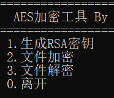

只要摁选项前的数字键就能进行选择。

## 编译、运行环境

- g++ (x86_64-posix-seh-rev0, Built by MinGW-W64 project) 8.1.0
- Windows 10 家庭中文版 19042.985

## 编译、运行环境

## 程序设计

### RSA 密钥文件

为了方便我是用 json 格式十进制明文存储密钥。使用了 nlohmann 的 [JSON for Modern C++](https://github.com/nlohmann/json) 。

### 填充算法设计

使用 PKCS5Padding 作为填充算法。

> 填充至符合块大小的整数倍，填充值最后一个字节为填充的数量数，其他字节填 0
> 
> 原始：FF FF FF FF FF FF FF FF FF
> 
> 填充：FF FF FF FF FF FF FF FF FF 07 07 07 07 07 07 07

为了避免源文件末尾恰好符合填充后的格式，的我这里规定当满足整数倍时也进行填充。

例：

> 原始：FF FF FF FF FF FF FF FF FF FF FF FF FF FF FF FF FF FF
> 
> 填充：FF FF FF FF FF FF FF FF FF FF FF FF FF FF FF FF FF FF 10 10 10 10 10 10 10 10 10 10 10 10 10 10 10 10

### 文件头

加密后的文件应该有一块区域存放 RSA 加密后的 key 和 initialization vector 。我称之为文件头（不知道应该叫啥）。

加密后的文件前 2048/8=256 字节为加密后密钥c1，之后是16字节 initialization vector ,最后是加密后文件c2.
文件头一共 272 字节.

大致情况如图所示：

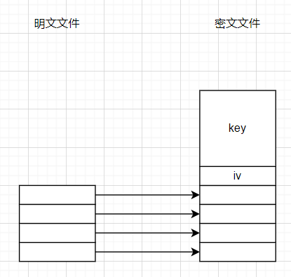

### 加密后文件规范

为了易于使用，强制要求加密后文件为 .aes 后缀。

解密时默认去除 .aes 后缀名。

## 如何编译并运行

1. 进入项目根目录；
2. 输入 `mingw32-make` 等待编译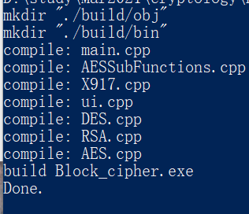
3. 输入 `mingw32-make run` 运行

## 运行例子

想对文件 1.png 加密。

### 生成 RSA 密钥

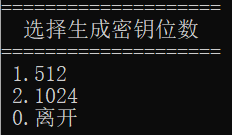

这里先选 512 位

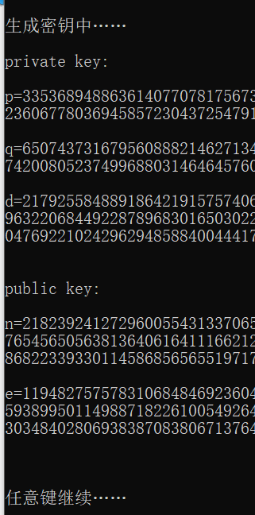

并将其保存

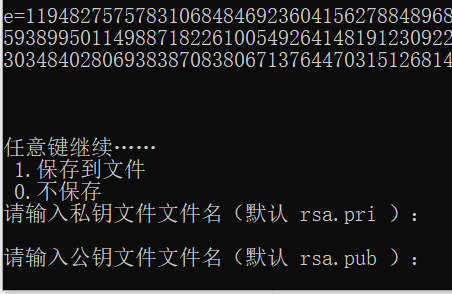

目录下即多两个文件。这是 RSA 的私钥和公钥。

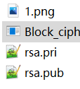

### 文件加密

选择文件加密，输入文件名、公钥：

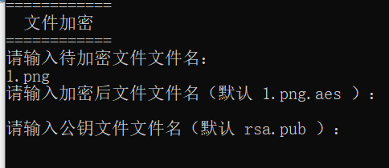

进度条走完就加密完成了

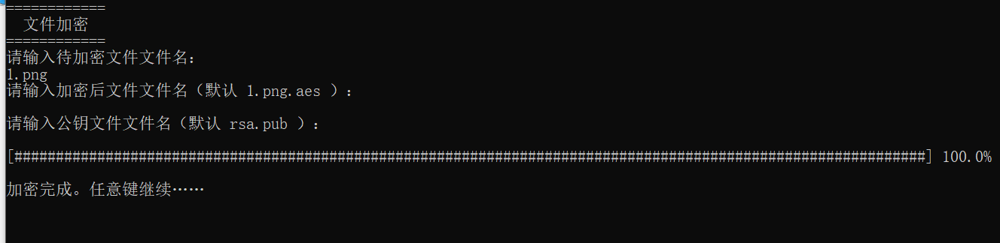

### 文件解密

选择文件解密，输入文件名、公钥：

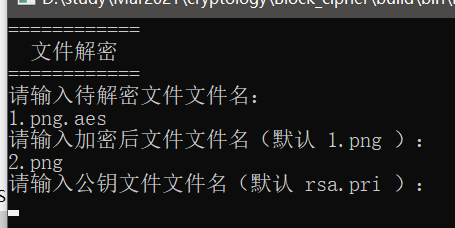

进度条走完就解密完成了

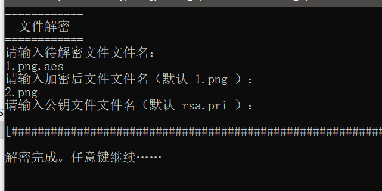

### 检查

- 2.png 可以正常打开
- 用 fc 命令检查，与 1.png 没有差异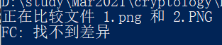

## 展望

- 多线程增加速度
- 用更好看的 UI

交作业的时候换回 GBK 了，为了在 win10 下有更好使用体验，这里还是 utf-8，啥时候 win11能普及，大家都用 utf-8 就好了。

其实也没必要。就一个小作业，差不多得了。