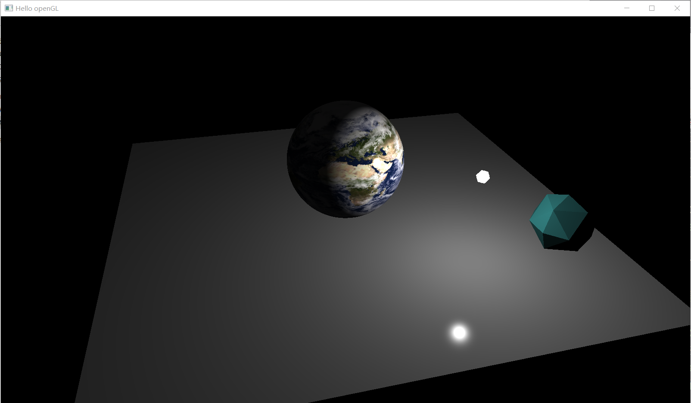

# 一个练习 OpenGL 封装的项目

## 前言

计算机图形学课程小作业副产物。当时对着 VAO, VBO 一堆的代码实在看得头疼。在做了一些微小工作之后，无意间发现我封装的东西在 learnOpenGL 上都有实现，况且大概比我封装的更为合理（悲）。
由于本人的固执——希望逐步修改使自己的封装更为合理而不是直接使用他人的成果（写都写了）。但图形学的课也快结束了，还要做其他的事情，所以一时半会不会来动这个项目。
将来希望把这个写成一个易于使用的渲染引擎，但是目前动机不大，而且似乎开源社区不缺类似的项目。
虽说如此，还是上传代码，说不定有用得上的时候。

本项目在 Windows 下运行，理应支持 linux，但没有做过任何跨平台的适配。
`mingw32-make run` 编译运行 demo。

本项目部分使用了 learnopengl.com 中的代码。

## 项目结构

- `./include` 头文件
- `lib` 链接库
- `rm_img` readme 的图片
- `resources` 资源文件夹
- `src` 代码

## 效果

