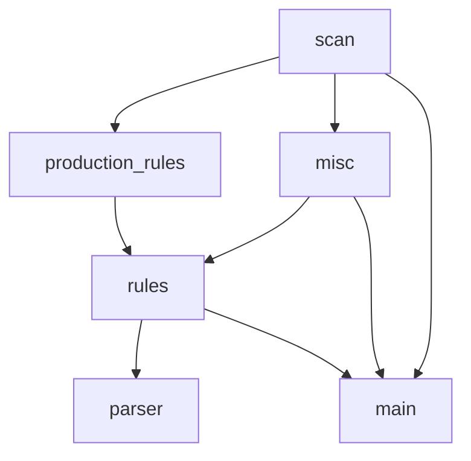

# lexer-parser
Lexer and parser for C family language.

**此乃Q神之作，YACC当其创作之时深恐为其征服，当其停止之时又恐随之云亡！**

↑ ?

## 主要文件列表

| 文件名               | 内容                              | 依赖                   | 主要负责人 | 代办                    |
| -------------------  | --------------------------------- | ---------------------- | ---------- | ----------------------- |
| grammar_reader.py | 实现对于文法定义的识别与解释      | top_down_analysis | q          |                         |
| main.py              | 程序入口                          | rules, scan      | q          | 改用LR                  |
| misc.py              | / | /                   | q          | 原来的函数都塞 main 里了 |
| parser.py            | LR 语法分析器                     | rules                  | w          | 实现对于 epsilon 的处理 |
| top_down_analysis.py | 自上而下语法分析                  | scan                   | q          |                        |
| scan.py              | 词法分析                          |                        | w          |                         |
| utility.py           | 公用函数                          |                        | w          |                         |
|  |  | |  | |

## 依赖可视化

mermaid :

